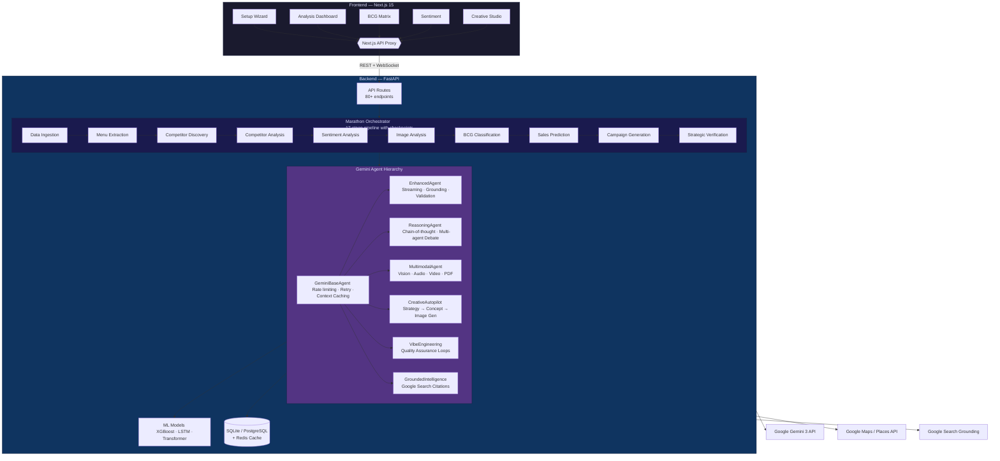

# 🍽️ RestoPilotAI

### AI-Powered Competitive Intelligence Platform for Restaurants
### Built with Google Gemini 3 Multimodal AI

[](https://ai.google.dev/)
[](https://opensource.org/licenses/MIT)
[](https://www.python.org/downloads/)
[](https://nextjs.org/)
[](https://fastapi.tiangolo.com/)

> **🏆 Built for the [Gemini 3 Hackathon](https://gemini3.devpost.com/)**

**Transform restaurant intelligence from a $5,000, 2-week consultant engagement into a ~$2, 5-minute AI-powered analysis.**

**🎥 [Watch Demo Video](#)** | **🚀 [Try Live Demo](#)** | **📚 [Documentation](./docs/)**

---

## 📋 Table of Contents

- [The Problem](#-the-problem)
- [Our Solution](#-our-solution)
- [Why Gemini 3?](#-why-gemini-3)
- [Architecture](#-architecture)
- [Key Features](#-key-features)
- [Tech Stack](#-tech-stack)
- [Installation](#-installation)
- [Usage](#-usage)
- [Project Structure](#-project-structure)
- [API Reference](#-api-reference)
- [AI Models & Reasoning](#-ai-models--reasoning)
- [Hackathon Tracks](#-hackathon-tracks)
- [Documentation](#-documentation)
- [License](#-license)

---

## 🎯 The Problem

Small and medium restaurants face a critical information asymmetry:

```
Traditional Competitive Analysis:
💰 Cost: $5,000 - $10,000
⏰ Time: 2-4 weeks
📊 Deliverable: 100-slide PowerPoint deck
🔄 Updates: Expensive, manual, delayed
�� Actionability: Low (generic recommendations)
```

**Result**: 70% of new restaurants fail within the first year, often because they don't understand their competitive landscape.

---

## 💡 Our Solution

**RestoPilotAI is an autonomous AI platform that:**

1. **📍 Discovers** — Automatically finds and maps competitors via Google Maps and web search
2. **🔍 Analyzes** — Processes multimodal data: images, videos, audio, text, PDFs, CSV
3. **🧠 Understands** — Deep reasoning using agentic patterns with transparent thought traces
4. **✅ Verifies** — Self-checks every analysis for consistency and hallucinations
5. **🎯 Strategizes** — Generates personalized BCG analysis, pricing strategies, and marketing campaigns
6. **🎨 Creates** — AI-generated visual campaign assets with native Gemini image generation
7. **📊 Visualizes** — Interactive dashboards with real-time streaming insights

```
RestoPilotAI:
💰 Cost: ~$2 per analysis
⏰ Time: ~5 minutes
📊 Deliverable: Interactive dashboard + actionable campaigns + generated images
🔄 Updates: Re-run anytime, instantly
🎯 Actionability: High (specific, personalized, data-driven)
```

---

## �� Why Gemini 3?

RestoPilotAI is **fundamentally built around Gemini 3's unique capabilities** that competing AI models cannot match:

| Capability | Gemini 3 | GPT-4V | Claude 3.5 | Impact for RestoPilotAI |
|------------|----------|--------|------------|------------------------|
| **Native Video Processing** | ✅ Direct | ❌ Frames only | ❌ No video | Analyze TikTok/Reels content |
| **Native Audio Processing** | ✅ Direct | ❌ Needs Whisper | ❌ No audio | Process owner's business story |
| **PDF Document Understanding** | ✅ Native | ✅ Yes | ✅ Yes | Extract menu data from any format |
| **Image Generation** | ✅ Native (Imagen 3) | ✅ DALL-E 3 | ❌ No | Generate campaign visuals in-platform |
| **Real-time Grounding** | ✅ Google Search | ⚠️ Limited | ❌ No | Live competitor data with citations |
| **Thinking Budget Control** | ✅ ThinkingLevel | ❌ No | ❌ No | Cost-optimized reasoning depth |

**Bottom Line**: Gemini 3 is the **only AI** that natively processes **video + audio + images + PDFs + web search** in a single unified model.

---

## 🏗️ Architecture



### Analysis Pipeline (17 Stages)

```
Data Ingestion → Menu Extraction → Competitor Parsing → Competitor Discovery
→ Competitor Enrichment → Competitor Verification → Neighborhood Analysis
→ Competitor Analysis → Sentiment Analysis → Image Analysis → Visual Gap Analysis
→ Context Processing → Sales Processing → BCG Classification → Sales Prediction
→ Campaign Generation → Strategic Verification → ✅ Completed
```

Each stage produces **thought signatures** and supports **checkpoint recovery**.

---

## ✨ Key Features

### 🍽️ Multimodal Menu Intelligence
- **OCR + AI Extraction** from menu photos, PDFs, and scanned documents
- **Dish Photo Analysis** with visual quality scoring and presentation assessment
- **Audio Business Context** — describe your restaurant verbally, AI understands
- **Video Analysis** — analyze restaurant environment, kitchen operations, service flow

### 📊 BCG Matrix & Menu Engineering
- **Automatic BCG Classification** — Star, Cash Cow, Question Mark, Dog
- **Menu Engineering Calculations** — contribution margin, popularity %, rotation
- **Period-based Analysis** — filter by date ranges for trend detection
- **Strategic Recommendations** — per-item actionable strategies

### 🏆 Competitive Intelligence
- **Automatic Competitor Discovery** via Google Maps proximity search
- **Deep Enrichment** — ratings, reviews, photos, operating hours, price level
- **Grounded Analysis** — Google Search citations for every competitive insight
- **Price Gap Detection** — category-level price comparison with actionable gaps
- **Market Position Mapping** — understand your place in the competitive landscape

### 💬 Sentiment Analysis
- **Google Maps Review Mining** — extract and analyze real customer reviews
- **Photo Sentiment** — visual appeal and presentation quality scoring
- **NPS Estimation** — Net Promoter Score derived from review patterns
- **Category Breakdown** — service, food quality, ambiance, value scores
- **Actionable Recommendations** — prioritized improvement suggestions

### 🎨 Creative Studio & Campaigns
- **AI Campaign Generation** — complete marketing campaign proposals
- **Native Image Generation** — Gemini 3 Pro Image generates campaign visuals
- **Creative Autopilot** — end-to-end visual campaign pipeline
- **A/B Variant Testing** — generate and compare creative variants
- **Instagram Engagement Prediction** — predict post performance before publishing
- **Menu Style Transformation** — AI-powered menu design reimagination
- **Multi-language Localization** — campaigns in multiple languages

### 📈 Sales Prediction
- **XGBoost Regression** — feature-engineered time-series forecasting
- **Neural Predictor** — LSTM/Transformer deep learning models
- **Scenario Modeling** — predict impact of price changes, promotions
- **Demand Forecasting** — hourly, daily, and seasonal patterns

### 🧠 Transparent AI Reasoning
- **Thought Signatures** — every analysis includes plan, observations, reasoning, assumptions
- **4-Level Thinking** — Quick (0.3°) → Standard (0.5°) → Deep (0.7°) → Exhaustive (0.8°)
- **Confidence Scores** — 0-1 confidence on every insight
- **Multi-Agent Debate** — agents argue positions for higher-quality conclusions
- **Vibe Engineering** — automatic quality assurance with iterative improvement

### 🔍 Google Search Grounding
- **Auto-cited Sources** — every competitive insight backed by web sources
- **Pricing Benchmarks** — market-level pricing data from web research
- **Trend Research** — food industry trends with source verification
- **Claim Verification** — verify any analysis claim against web data

### ⚡ Real-time Experience
- **WebSocket Streaming** — live pipeline progress and AI thought traces
- **Marathon Agent** — long-running tasks with checkpoint recovery
- **Streaming Analysis** — BCG results stream as they're computed

### 📦 Context Caching (Cost Optimization)
- **Gemini Context Caching API** — large menu images and documents cached server-side
- **75% cost reduction** on cached input tokens for repeated queries
- **Lower latency** — cached content skips re-tokenization
- **Automatic lifecycle** — caches created per-session with configurable TTL (default 30 min)
- **Use cases**: Menu OCR → allergen scan → pricing analysis → BCG enrichment (same image, 4 queries, 1 cache)

---

## 🛠️ Tech Stack

### Backend
| Component | Technology |
|-----------|-----------|
| Framework | FastAPI 0.115+ (async Python) |
| AI Engine | Google Gemini 3 Pro (`google-genai` 1.0.0) |
| ML/DL | scikit-learn, XGBoost 2.0, PyTorch (LSTM/Transformer) |
| Database | SQLAlchemy 2.0 + SQLite (dev) / PostgreSQL 15 (prod) |
| Cache | Redis 7 + in-memory LRU + **Gemini Context Caching** |
| OCR | Pillow, pytesseract, pdf2image, PyMuPDF |
| Real-time | WebSocket (native FastAPI) |

### Frontend
| Component | Technology |
|-----------|-----------|
| Framework | Next.js 15 (App Router, standalone) |
| Language | TypeScript 5.3 |
| Styling | TailwindCSS 3.4 + tailwindcss-animate |
| Components | Radix UI (Tabs, Tooltip, Select, Popover, etc.) |
| Charts | Recharts 2.15 |
| Animations | Framer Motion 12 |
| Maps | @react-google-maps/api |
| Icons | Lucide React |

### Infrastructure
| Component | Technology |
|-----------|-----------|
| Containerization | Docker + Docker Compose |
| CI/CD | GitHub Actions |
| Deployment | Google Cloud Run (frontend + backend) |

---

## 🚀 Installation

### Prerequisites
- **Python** 3.11+
- **Node.js** 18+
- **Google Gemini API Key** — [Get one at AI Studio](https://aistudio.google.com/apikey)
- **Google Maps API Key** *(optional)* — for competitor discovery & location features

### Quick Start

```bash
# 1. Clone the repository
git clone https://github.com/RestoPilotAI/RestoPilotAI.git
cd RestoPilotAI

# 2. Configure environment
cp .env.example .env
# Edit .env and add your GEMINI_API_KEY

# 3. Setup both backend and frontend
make setup

# 4. Run the application
make run
```

This starts:
- **Backend** at `http://localhost:8000` (API docs at `/docs`)
- **Frontend** at `http://localhost:3000`

### Manual Setup

```bash
# Backend
cd backend
python -m venv venv
source venv/bin/activate
pip install -r requirements.txt
uvicorn app.main:app --reload --port 8000

# Frontend (in another terminal)
cd frontend
npm install
npm run dev
```

### Docker

```bash
docker-compose up --build
```

Services: Backend (:8000), Frontend (:3000), PostgreSQL (:5432), Redis (:6379)

### Quick Verification Commands

After starting the backend, verify all services are operational:

```bash
# 1. Health check
curl http://localhost:8000/api/v1/health

# 2. Creative Autopilot (campaign generation)
curl -X POST "http://localhost:8000/api/v1/campaigns/creative-autopilot?restaurant_name=TestResto&dish_id=1&session_id=test&target_languages=es&target_languages=en"

# 3. Vibe Engineering (quality verification)
curl -X POST http://localhost:8000/api/v1/vibe-engineering/verify-analysis \
  -H "Content-Type: application/json" \
  -d '{"analysis_type":"bcg","analysis_result":{"test":true},"source_data":{},"auto_improve":true}'

# 4. Grounding (Google Search verification)
curl -X POST http://localhost:8000/api/v1/grounding/verify \
  -H "Content-Type: application/json" \
  -d '{"claim":"Restaurant industry average food cost is 28-35%","context":"pricing analysis"}'

# 5. Frontend build check
cd frontend && npm run build
```

---

## 📖 Usage

### 1. Setup Wizard
Navigate to `http://localhost:3000`. The setup wizard guides you through:
1. **Location** — Search for your restaurant on Google Maps
2. **Menu** — Upload menu photos/PDFs (drag-and-drop)
3. **Sales Data** — Upload CSV/XLSX sales records
4. **Context** — Add business context (text or audio recording)
5. **Competitors** — Paste competitor info or let AI discover them
6. **Launch** — Start the autonomous analysis pipeline

### 2. Demo Mode
Click **"Try Demo"** on the landing page to load a pre-built session with sample data.

### 3. Analysis Dashboard
After analysis completes, explore five tabs:

| Tab | What You See |
|-----|-------------|
| **Overview** | Business info, analysis progress, key metrics |
| **BCG Matrix** | Interactive menu engineering chart, strategic classifications |
| **Competitors** | Enriched competitor profiles, Google Maps data |
| **Sentiment** | Review analysis, NPS, category scores, recommendations |
| **Campaigns** | AI-generated campaigns, creative assets, A/B variants |

---

## 📁 Project Structure

```
RestoPilotAI/
├── backend/                     # FastAPI Python backend
│   ├── app/
│   │   ├── api/routes/          # 12 route modules, 80+ endpoints
│   │   ├── core/                # Config, caching, rate limiting, WebSocket
│   │   ├── models/              # SQLAlchemy ORM models
│   │   ├── schemas/             # Pydantic request/response schemas
│   │   └── services/            # Business logic
│   │       ├── analysis/        # BCG, menu, sentiment, pricing, neural
│   │       ├── campaigns/       # Campaign generation
│   │       ├── gemini/          # 14 AI agent modules
│   │       ├── imagen/          # Native Gemini image generation
│   │       ├── intelligence/    # Competitor discovery & enrichment
│   │       └── orchestrator.py  # 17-stage autonomous pipeline
│   ├── data/                    # Runtime data (uploads, DB, models)
│   ├── tests/                   # pytest test suite
│   ├── requirements.txt
│   ├── Dockerfile
│   └── README.md                # Backend documentation
├── frontend/                    # Next.js 15 frontend
│   ├── public/images/           # Professional restaurant imagery
│   ├── src/
│   │   ├── app/                 # App Router pages
│   │   ├── components/          # 90+ React components
│   │   │   ├── ai/              # Thought streams, confidence, debates
│   │   │   ├── analysis/        # BCG, sentiment, competitor dashboards
│   │   │   ├── creative/        # Campaign generation, A/B testing
│   │   │   ├── multimodal/      # Menu OCR, video, audio, photos
│   │   │   ├── marathon-agent/  # Pipeline progress, checkpoints
│   │   │   ├── setup/           # Wizard steps, file upload, location
│   │   │   └── vibe-engineering/# Quality assurance UI
│   │   ├── hooks/               # 7 custom hooks (WebSocket, API, etc.)
│   │   └── lib/api/             # Typed API client (50+ methods)
│   ├── Dockerfile
│   └── README.md                # Frontend documentation
├── docs/                        # Extended documentation
│   ├── ADVANCED_MULTIMODAL_GUIDE.md
│   ├── ADVANCED_REASONING_GUIDE.md
│   ├── ENHANCED_AGENT_USAGE.md
│   ├── GROUNDING_GUIDE.md
│   ├── STREAMING_GUIDE.md
│   └── VIDEO_ANALYSIS_GUIDE.md
├── scripts/                     # Setup and utility scripts
│   ├── seed_demo_data.py        # Generate demo restaurant data
│   ├── setup_api_key.sh         # API key configuration helper
│   └── test_gemini_api.py       # Gemini API diagnostic tool
├── tests/                       # Test suite (pytest)
│   ├── smoke_test_demo.py       # Demo data smoke tests
│   ├── test_apis.py             # API endpoint tests
│   ├── test_competitive_intelligence.py
│   ├── test_vibe_engineering.py
│   └── test_wow_features.py
├── docker-compose.yml           # Multi-service Docker orchestration
├── cloudbuild.yaml              # Google Cloud Build config (Cloud Run)
├── Makefile                     # Development commands
├── .env.example                 # Environment variable template
├── MODEL_CARD.md                # AI Model Card
├── DATA_CARD.md                 # Data Card
└── README.md                    # This file
```

---

## 📡 API Reference

The backend exposes **80+ REST endpoints** + **WebSocket channels** under `/api/v1/`.

### Core Endpoint Groups

| Group | Prefix | Endpoints | Description |
|-------|--------|-----------|-------------|
| **Ingestion** | `/ingest/*` | 5 | Upload menus, sales, dishes, audio |
| **Session** | `/session/*` | 3 | Get/export session data |
| **Location** | `/location/*` | 5 | Google Maps search, competitor discovery |
| **Analysis** | `/analyze/*` | 6 | BCG, competitors, sentiment, optimization |
| **Prediction** | `/predict/*` | 2 | XGBoost + neural forecasting |
| **Campaigns** | `/campaigns/*` | 4 | Campaign generation + creative autopilot |
| **Creative** | `/creative/*` | 4 | Menu transform, Instagram prediction |
| **Grounding** | `/grounding/*` | 5 | Google Search verification + benchmarks |
| **Marathon** | `/marathon/*` | 10 | Long-running tasks + WebSocket streaming |
| **Vibe Engineering** | `/vibe-engineering/*` | 5 | Quality assurance verification |
| **Video** | `/video/*` | 2 | Video analysis |
| **Streaming** | `/streaming/*` | 1 | Real-time BCG streaming |
| **Monitoring** | `/gemini/*` | 3 | Model usage and cost tracking |
| **Demo** | `/demo/*` | 2 | Demo data loading |
| **WebSocket** | `/ws/*` | 3 | Real-time progress + live updates |

Full endpoint documentation: **`http://localhost:8000/docs`** (Swagger UI)

---

## 🧠 AI Models & Reasoning

### Gemini 3 Models Used

| Model | ID | Purpose | Thinking Level |
|-------|-----|---------|---------------|
| **Gemini 3 Pro** | `gemini-3-pro-preview` | Primary reasoning, analysis, multimodal | DEEP → EXHAUSTIVE |
| **Gemini 3 Pro** | `gemini-3-pro-preview` | Vision (menu OCR, dish analysis) | DEEP |
| **Gemini 3 Pro Image** | `gemini-3-pro-image-preview` | Native image generation for campaigns | — |
| **Gemini 3.0 Flash** | `gemini-3.0-flash` | Fast fallback, audio transcription | QUICK |

### Thinking Levels

| Level | Temperature | Max Tokens | Used For |
|-------|------------|------------|----------|
| **QUICK** | 0.3 | 2,048 | Simple extractions, formatting |
| **STANDARD** | 0.5 | 4,096 | Menu extraction, basic analysis |
| **DEEP** | 0.7 | 8,192 | BCG classification, sentiment, menu extraction |
| **EXHAUSTIVE** | 0.8 | 16,384 | Competitive intelligence, video analysis, campaign strategy |

### Traditional ML Models

| Model | Library | Purpose |
|-------|---------|---------|
| **XGBoost Regressor** | xgboost 2.0 | Sales prediction with engineered features |
| **LSTM Network** | PyTorch | Sequence-based demand forecasting |
| **Transformer** | PyTorch | Attention-based time-series prediction |
| **BCG Classifier** | Custom + Gemini | Menu item strategic quadrant classification |

### Agent Architecture

```
GeminiBaseAgent
  ├── EnhancedGeminiAgent     (streaming, grounding, caching, validation)
  │   ├── GroundedIntelligence (Google Search auto-citations)
  │   └── CampaignImageGenerator (native Gemini image generation)
  ├── ReasoningAgent           (chain-of-thought, multi-step reasoning)
  ├── MultimodalAgent          (vision, audio, video processing)
  ├── CreativeAutopilotAgent   (campaign strategy → concept → visuals)
  ├── VibeEngineeringAgent     (quality assurance iteration loops)
  ├── VerificationAgent        (self-verification for hallucination detection)
  ├── MarathonAgent            (long-running tasks with checkpoints)
  └── StreamingAgent           (real-time generation streaming)
```

---

## 🏆 Hackathon Tracks

RestoPilotAI implements **all major hackathon tracks**:

### 1. Marathon Agent
- 17-stage autonomous pipeline with **checkpoint recovery**
- Crash-resilient execution with state serialization
- WebSocket streaming for real-time progress

### 2. Creative Autopilot
- End-to-end campaign pipeline: Strategy → Concept → Image Generation → Copy
- **Native Gemini image generation** (`gemini-3-pro-image-preview`)
- A/B variant generation and multi-language localization

### 3. Vibe Engineering
- Automatic quality assurance with configurable thresholds (default: 0.85)
- Iterative improvement loops (max 3 cycles)
- Transparent reasoning with thought bubble streaming

### 4. Google Search Grounding
- Competitive intelligence with **auto-cited web sources**
- Market pricing benchmarks from live web data
- Food industry trend research with source verification

### 5. Thought Signatures
- Every analysis produces a `ThoughtSignature` with:
  - Plan, observations, reasoning chain, assumptions
  - Confidence score (0-1) and verification checks
  - Corrections made during processing

### 6. Context Caching
- **Gemini Context Caching API** for large menu images and business documents
- 75% input-token cost reduction across repeated queries on the same content
- Automatic TTL management per analysis session

---

## 🏆 Why We Should Win

| Category | Why RestoPilotAI Excels |
|----------|------------------------|
| **Best Use of Multimodal** | End-to-end multimodal pipeline: **Photo → Data → New Photo (Marketing)**. Menu images are ingested, analyzed for items/allergens/pricing, then the same data drives AI-generated campaign visuals via Imagen 3. Video, audio, and PDF are all processed natively — no external APIs. |
| **Best Real-World Application** | This is a **product you could sell tomorrow**. Small restaurants spend $5k–$10k on competitive analysis; RestoPilotAI delivers it for ~$2 in 5 minutes. Every feature maps to a real business need: menu engineering, competitor tracking, campaign creation. |
| **Most Creative Use of Gemini** | **8 specialized AI agents** orchestrated in a 17-stage autonomous pipeline with multi-agent debate, self-verification loops (Vibe Engineering), Google Search grounding with auto-citations, thought transparency, and checkpoint recovery. No other submission uses this depth of agentic orchestration. |

---

## 📚 Documentation

| Document | Description |
|----------|-------------|
| [Backend README](./backend/README.md) | Full API reference, services, pipeline stages |
| [Frontend README](./frontend/README.md) | Components, hooks, pages, architecture |
| [Model Card](./MODEL_CARD.md) | AI model specifications, biases, limitations |
| [Data Card](./DATA_CARD.md) | Data flows, schemas, privacy considerations |
| [Advanced Multimodal Guide](./docs/ADVANCED_MULTIMODAL_GUIDE.md) | Video, audio, image, PDF processing |
| [Advanced Reasoning Guide](./docs/ADVANCED_REASONING_GUIDE.md) | Reasoning patterns, multi-agent debate |
| [Enhanced Agent Usage](./docs/ENHANCED_AGENT_USAGE.md) | Agent configuration and usage |
| [Grounding Guide](./docs/GROUNDING_GUIDE.md) | Google Search integration |
| [Streaming Guide](./docs/STREAMING_GUIDE.md) | Real-time streaming architecture |
| [Video Analysis Guide](./docs/VIDEO_ANALYSIS_GUIDE.md) | Video processing pipeline & demo script |

---

## ⚙️ Environment Variables

```bash
# Required
GEMINI_API_KEY=your_gemini_api_key_here

# Optional (enables location & competitor features)
GOOGLE_MAPS_API_KEY=your_google_maps_key_here

# Application
APP_ENV=development          # development | production
DEBUG=true
LOG_LEVEL=INFO

# Database
DATABASE_URL=sqlite+aiosqlite:///./data/RestoPilotAI.db

# Server
HOST=0.0.0.0
PORT=8000
CORS_ORIGINS=http://localhost:3000,http://127.0.0.1:3000
```

See [`.env.example`](.env.example) for all available options.

---

## 🧪 Development Commands

```bash
make setup          # Setup both backend and frontend
make run            # Run both (backend :8000 + frontend :3000)
make run-backend    # Run backend only
make run-frontend   # Run frontend only
make docker         # Build and run with Docker Compose
make test           # Run backend tests
make lint           # Run linters
make typecheck      # TypeScript type checking
make clean          # Clean temporary files
make demo           # Generate demo data
```

---

## 📋 Hackathon Submission Checklist

### Devpost Submission
- [ ] **Title**: RestoPilotAI — AI-Powered Restaurant Intelligence
- [ ] **Tagline**: Transform restaurant competitive analysis from $5,000 to $2 with Gemini 3
- [ ] **Description**: Full project overview with Gemini 3 capabilities
- [ ] **Built With**: Google Gemini 3 Pro, FastAPI, Next.js 15, Python, TypeScript, TailwindCSS, Radix UI, XGBoost, PyTorch
- [ ] **Tracks**: Marathon Agent, Creative Autopilot, Vibe Engineering, Google Search Grounding
- [ ] **Demo Video**: 3-minute walkthrough (upload, BCG analysis, Creative Autopilot, Vibe Engineering, Competitive Intelligence)
- [ ] **Screenshots**: Dashboard, BCG Matrix, Creative Studio, Competitor Analysis, Sentiment
- [ ] **GitHub Link**: Repository URL
- [ ] **Live Demo**: Deployed URL (if available)

### Technical Verification
- [x] All Gemini 3 models configured (Pro for reasoning, Pro Image for generation)
- [x] Google Search grounding with auto-citations
- [x] Native image generation (not DALL-E or external)
- [x] WebSocket streaming for real-time progress
- [x] Marathon Agent with checkpoint recovery
- [x] Vibe Engineering iterative quality loops
- [x] Creative Autopilot full pipeline (strategy → concept → visuals → A/B → localization)
- [x] Thought signatures on every analysis
- [x] Multi-agent debate system
- [x] 17-stage autonomous analysis pipeline
- [x] Frontend build succeeds with zero errors
- [x] All API endpoints return valid responses

---

## 📄 License

This project is licensed under the **MIT License** — see the [LICENSE](LICENSE) file for details.

---

## 👥 Team

**RestoPilotAI Team** — Built with ❤️ for the Gemini 3 Hackathon

---

<p align="center">
  <strong>RestoPilotAI</strong> — AI-Powered Restaurant Intelligence<br>
  <em>Powered by Google Gemini 3 Pro • Built with FastAPI + Next.js 15</em>
</p>
